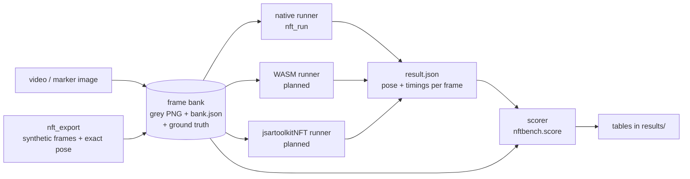

# artoolkit-nft-bench

[](LICENSE)
[](https://github.com/webarkit/artoolkit-nft-bench/releases)
[](native)
[](python)

**Is native ARToolKit5 NFT faster, more responsive and more precise than jsartoolkitNFT in the browser?**

This repository answers that question with reproducible numbers. It runs ARToolKit-family NFT (natural feature tracking)
engines on *identical* frames, with known or measured ground truth, and scores them with one engine-independent scorer.
Engines are compared one change at a time: native artoolkit5 → the same sources compiled to WASM → jsartoolkitNFT
(WebARKitLib in WASM) in Node → in Chromium.

**Status:** M1 (native baseline) is released as [v0.1.0](https://github.com/webarkit/artoolkit-nft-bench/releases/tag/v0.1.0).
Next: project infrastructure (M2) and real-footage ground truth (M3); see the [roadmap](#roadmap).

## Results so far (native artoolkit5)

From [results/phase1](results/phase1/README.md): MSVC 2022, Intel Core i7-9700, marker `pinball.jpg` at 220 dpi.

| | result |
|---|---|
| KPM detection, synthetic 640x480 | 100% up to 4x reference distance, 55° tilt, blur σ 3, noise σ 30, 40% occlusion; median corner error 0.2–0.5 px; 30–75 ms per detection |
| AR2 tracking, synthetic | 100% of frames up to 20 px/frame, 0.6–0.9 px error, ~1 ms per frame; fails at 35 px/frame with motion blur |
| Real clip (`pinball-bench.mp4`, 1280x720) | one detection (73 ms), then 297 frames tracked without a loss at 1.2 ms per frame; 5.1 px median error against segmented ground truth (camera not calibrated yet) |
| Threads | AR2 threads halve tracking time; KPM (FREAK) is single-threaded |

Raw data: [artoolkit-nft-bench-results](https://github.com/webarkit/artoolkit-nft-bench-results) (release
[`phase-1`](https://github.com/webarkit/artoolkit-nft-bench-results/releases/tag/phase-1)), verifiable through
[`results/manifest.json`](results/manifest.json).

## How it works



* A **frame bank** is decoded once and read by every engine, so video decoding never differs between engines.
* **Runners never see ground truth**; they write poses and timings in a common `result.json`.
* The **scorer** compares results with the bank's ground truth, and refuses a result produced with another marker or camera.

## Reproduce in three commands

After the [setup](#setup-windows):

```bash
scripts/run_phase1.sh
.venv/Scripts/python -m nftbench.score --bank banks/synthetic-d220 --result results/local/phase1/native-synthetic-d220-t1.json
.venv/Scripts/python -m nftbench.score --bank banks/pinball-bench --result results/local/phase1/native-pinball-bench-t1.json
```

`run_phase1.sh` generates the marker if missing, builds the synthetic and real-clip banks (with corner segmentation), and runs
`nft_run` at 1 thread and at default threads (`REPEATS=5`, first pass discarded). It takes a while; results go to the
git-ignored `results/local/phase1/`.

## Setup (Windows)

```bash
git clone --recurse-submodules https://github.com/webarkit/artoolkit-nft-bench.git
cd artoolkit-nft-bench
cmake -S . -B build/win-vs2022 -G "Visual Studio 17 2022" -A x64      # fetches zlib, libjpeg-turbo, nlohmann/json, stb
cmake --build build/win-vs2022 --config Release
python -m venv .venv
.venv/Scripts/python -m pip install --use-feature=truststore -r requirements-dev.txt
.venv/Scripts/python -m pip install --use-feature=truststore --no-build-isolation -e .
```

* `--use-feature=truststore` makes pip use the Windows certificate store; drop it where Python's own CA bundle works.
* Linux/gcc: `tools/docker_build.sh` in an `ubuntu:24.04` container (`ARX_FETCH_DEPS=OFF` uses the system zlib/libjpeg).
* Set a machine label for result headers in the git-ignored `bench.local.json`: `{"host_label": "desktop-1"}`.

## Tests

```bash
ctest --test-dir build/win-vs2022 -C Release
.venv/Scripts/python -m pytest -q
```

`pytest` drives the built `nft_export`/`nft_run` binaries and checks the LGPL header of every source file.

## Layout

| path | content |
|---|---|
| `extern/artoolkit5` | [webarkit/artoolkit5](https://github.com/webarkit/artoolkit5) submodule, pinned, **never modified** |
| `CMakeLists.txt`, `cmake/` | out-of-tree build of `ARUtil`, `AR`, `ARICP`, `AR2`, `KPM` and `genTexData` (no GL, video or OSG) |
| `native/` | `nft_export` (synthetic banks), `nft_run` (native runner), unit tests |
| `python/nftbench/` | schemas, scorer, real-video bank, corner segmentation, results publisher |
| `data/markers/`, `data/videos/` | NFT datasets named after their parameters; test clip with provenance |
| `scripts/` | `run_phase1.sh`, `make_marker.sh`, `make_video_bank.py`, `segment_bank.py`, `publish_results.py`, `license_headers.py` |
| `results/` | result tables and `manifest.json` (raw results live in the results repository) |
| `docs/` | [spec](docs/superpowers/specs/2026-10-03-artoolkit-nft-bench-design.md), [plans](docs/superpowers/plans/), [ADRs](docs/adr/) |

## Roadmap

Tracked as [milestones](https://github.com/webarkit/artoolkit-nft-bench/milestones), each closed by a release
([ADR-0002](docs/adr/0002-milestones-and-releases.md)):

| milestone | content | release |
|---|---|---|
| M1 — Native baseline | CMake build, frame banks, scorer, native runner, first results | [v0.1.0](https://github.com/webarkit/artoolkit-nft-bench/releases/tag/v0.1.0) |
| M2 — Project infrastructure | README, agent files, skills, hooks, CI | v0.2.0 |
| M3 — Real-footage ground truth | camera calibration, manual annotations, new footage | v0.3.0 |
| next | same sources in WASM, then jsartoolkitNFT (Node, Chromium), then marker generators | |

## Contributing

Read [CONTRIBUTING.md](CONTRIBUTING.md): pull requests target `dev`, Conventional Commits, every source file carries the LGPL
header. Coding agents start from [AGENTS.md](AGENTS.md).

## License

[LGPL-3.0-or-later](LICENSE) (with the [GPL-3.0](COPYING) text it extends), like
[artoolkit5](https://github.com/webarkit/artoolkit5) and the [webarkit](https://github.com/webarkit) organisation.
